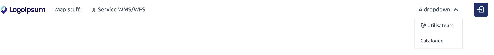

# geOrchestra header

The geOrchestra header is a Vue-based web component (`geor-header`) that provides
a shared header and navigation bar for geOrchestra applications.




## What it does

- Consistent branding and navigation across apps
- Configurable menus, login/logout, and i18n labels
- Optional legacy iframe header for older integrations

## Quick usage

```html
<script src="https://cdn.jsdelivr.net/gh/georchestra/header@dist/header.js"></script>
<geor-header></geor-header>
```


